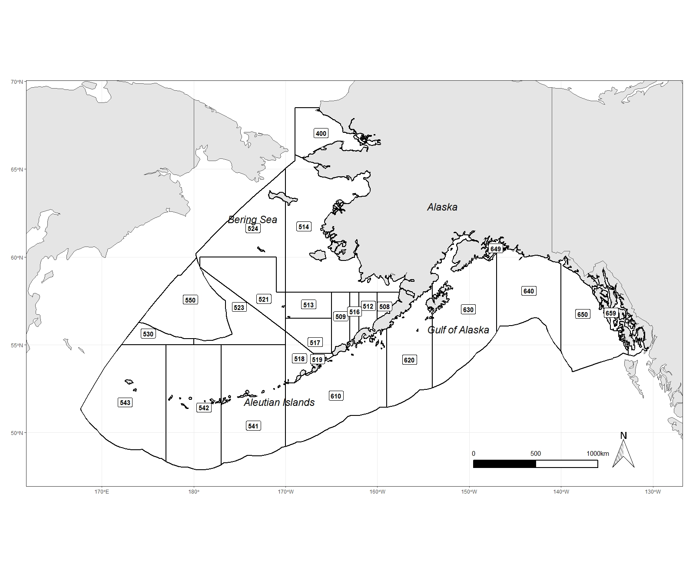

<br>

 

<br>

<br>

<br>

<br>

<br>

<br>

<br>

<br>

<br>

<br>

<br>


```{r setup, include=FALSE}
knitr::opts_chunk$set(echo = TRUE)
```


```{r, echo=FALSE, message=FALSE, warning=FALSE}
library(flextable)
library(tidyverse)
tibble(Date=c("11/29/2021",NA, NA), 
                     Author=c("Matt Callahan","",""),
                     Comments=c("Original version","",""),
                     Version=c("1.0","",""))%>%
  flextable()%>%
  fit_to_width(max_width = 8.5)%>%
  theme_box()%>%
  bg(bg="light gray", part = "header")%>%
  width(j=c("Date", "Author", "Version"), width =1.1)%>%
  width(j="Comments", width=3)

```
\newpage


## Subject
The crw_sst_gridded_nmfs web service provides NOAA Coral Reef Watch (CRW) sea surface temperature (SST) data as well as depth and NMFS area from the AKFIN database. 

## Background 
This web service was originally created for Emily Lemagie (PMEL) to access SST data and subset by NMFS area, depth, location, and time. This allows analysts more flexibility to examine SST data in custom areas than the existing AKFIN web service, which simply queries SST averaged daily across each NMFS area. These data are publicly available thus this web service requires no authentication. 

## Data Sources
This web service queries the erddap_crw_sst and erddap_crw_sst_spatial_lookup tables in the afsc schema. CRW SST data (Liu et al. 2015) are ingested into AKFIN daily and merged with marine management area and depth information. Spatial resolution for CRW SST data is a 5km grid (>210,000 points) and the time series extends from January 1985 through present (>13,000 days). Depth data is derived from NOAA marmap package in R (Pante and Bouhet 2015). Figure 1 shows locations of NMFS areas. Watson and Callahan (in press) provide a full description of SST data integration into AKFIN.

**References:**

<br>

Liu G., Heron S.F., Mark Eakin C., Muller-Karger F.E., Vega-Rodriguez M., Guild L.S., Cour J.L. de la, Geiger E.F., Skirving W.J., Burgess T.F.R., Strong A.E., Harris A., Maturi E., Ignatov A., Sapper J., Li J., and S. Lynds. Reef-scale thermal stress monitoring of coral ecosystems: New 5-km global products from NOAA coral reef watch. Remote Sens. 6(11), 11579-11606 .

<br>

Pante E., and Bouhet, B.S. 2013. Marmap: a package for importing, plotting and analyzing Bathymetric and topographic data in R. PLoS One 8 (9), e73051. 

<br>

Watson J. and Callahan M. in press. Automated and operational access to environmental data for Alaska’s management areas. Accepted NOAA processed report.
 
 

<br>

## Data Access URL
**Base URL:** https://apex.psmfc.org/akfin/data_marts/akmp/crw_sst_gridded_nmfs

<br>


**Parameters**


```{r, echo=FALSE, message=FALSE, warning=FALSE}
tibble(Parameter=c("start_date","end_date", "nmfs_area", "min_lat", "max_lat", "min_lon", "max_lon", "min_depth", "max_depth"), 
                     Description=c("Specify start date in YYYYMMDD format","Specify end date, entries in the future return the latest value", "NMFS reporting area, see figure 1 above for locations", "minimum latitude", "maximum latitude", "minimum longitude", "maximum longitude, negative and positive longitude should be queried seperately", "minimum depth (meters)", "maximum depth (meters)"),
                     Requirement=c("Required", "Required", "Optional", "Optional", "Optional", "Optional", "Optional", "Optional", "Optional"),
                     Values=c("19850101 to present","19850101 to present", "see figure 1", "47.5 to 68.5","47.5 to 68.5", "-180 to -130.125; 167.525 to 180", "-180 to -130.125; 167.525 to 180", "-7578 to 0", "-7578 to 0"))%>%
  flextable()%>%
  fit_to_width(max_width = 8.5)%>%
  theme_box()%>%
  bg(bg="light gray", part = "header")%>%
   set_table_properties(layout="autofit")

```

<br>

**Example URLs:**

<br>

* Retrieve data for a single day across the entire area (January 1, 2021): https://apex.psmfc.org/akfin/data_marts/akmp/crw_sst_gridded_nmfs?start_date=20210101&end_date=20210102

* Retrieve data for a single location for the whole time series: https://apex.psmfc.org/akfin/data_marts/akmp/crw_sst_gridded_nmfs?start_date=19850101&end_date=20351225&min_lon=-168.975&max_lon=-168.975&min_lat=65.875&max_lat=65.875

* Retrieve data from a specified rectangle for a single day.
https://apex.psmfc.org/akfin/data_marts/akmp/crw_sst_gridded_nmfs?start_date=20210101&end_date=20210102&min_lon=-151&max_lon=-150&min_lat=58&max_lat=59

* Retrieve data for the first week in 2020 in NMFS area 610: https://apex.psmfc.org/akfin/data_marts/akmp/crw_sst_gridded_nmfs?start_date=20200101&end_date=20200108&nmfs_area=513

* Retrieve data for the first week of 2020 in NMFS area 640 and 650 between 50 and 200m depth: https://apex.psmfc.org/akfin/data_marts/akmp/crw_sst_gridded_nmfs?start_date=20200101&end_date=20200108&nmfs_area=640,650&min_depth=-200&max_depth=-50


## Data Download (R)
This is a large data set and downloads of large areas and/or long time spans may take a long time.

```{r eval=FALSE, message=FALSE, warning=FALSE}
#install packages if not already downloaded
library(httr) #for accessing web services
library(tidyverse) #for converting data into exportable data frame

#Example: Retrieve data for a single day and single location
#Modify this url as desired for a custom data query
sst<-httr::content(
  httr::GET('https://apex.psmfc.org/akfin/data_marts/akmp/crw_sst_gridded_nmfs?start_date=20210101&end_date=20210102&min_lon=-168.975&max_lon=-168.975&min_lat=65.875&max_lat=65.875'), 
  type = "application/json") %>% 
    bind_rows

```


## Field descriptions

```{r, echo=FALSE, message=FALSE, warning=FALSE}
tibble(Parameter=c("CRW_ID", "LONGITUDE", "LATITUDE","READ_DATE", "TEMP", "DEPTH","NMFSAREA"), 
                     Description=c("ID assigned to each cell", "longitude (decimal degrees)", "Latitude (decimal degrees)", "date (YYYY-MM-DDTHH:MM:SSZ)", "temperature (C)", "Depth (m)", "NMFS reporting area")
                     )%>%
  flextable()%>%
  fit_to_width(max_width = 8.5)%>%
  theme_box()%>%
  bg(bg="light gray", part = "header")%>%
   set_table_properties(layout="autofit")

```


## Source code
Below is the sql code used in the web service.

```{r eval=FALSE, message=FALSE, warning=FALSE}

select sst.crw_id, 
   lkp.longitude, 
   lkp.latitude, 
   sst.read_date, 
   sst.temp, 
   lkp.depth, 
   lkp.nmfsarea
  from afsc.erddap_crw_sst sst
  left join afsc.erddap_crw_sst_spatial_lookup lkp
    on sst.crw_id=lkp.id
  where nmfsarea in (select * from   table(apex_string.split(nvl(:nmfs_area,nmfsarea),','))) 
    and depth between nvl(:min_depth,-7578)and nvl(:max_depth, 0)
    and latitude between nvl(:min_lat, 47.5)and nvl(:max_lat, 68.5)
    and longitude between nvl(:min_lon, -180)and nvl(:max_lon, 180)
    and read_date between to_date(replace(:start_date,'-',''),'YYYYMMDD') 
    and to_date(replace(:end_date,'-',''),'YYYYMMDD')
  order by read_date, nmfsarea,longitude,latitude;
  
```
  
  
  